# GTEx RNA-Seq Clustering

This project utilizes unsupervised machine learning techniques to analyze GTEx RNA-Seq gene expression data and identify biologically meaningful clusters of human tissues. It showcases dimensionality reduction, clustering, and validation techniques in a transcriptomic context.

---

## 🚀 Features

- Clustering using **K-Means**, **Gaussian Mixture Models (GMM)**, and **DBSCAN**
- Dimensionality reduction with **PCA**, **t-SNE**, and **UMAP**
- Evaluation using **Silhouette Score**, **Calinski-Harabasz Index**, **Davies-Bouldin Index**, **Adjusted Rand Index (ARI)**, and **Normalized Mutual Information (NMI)**
- Visualizations including confusion matrices, UMAP/t-SNE plots, and PCA variance plots

---

## 📊 Dataset

The data used in this project is from the [GTEx (Genotype-Tissue Expression)](https://gtexportal.org/home/datasets) project.

- 📁 **Expression Data:**  
  [GTEx_Analysis_v10_RNASeQCv2.4.2_gene_tpm.gct.gz](https://storage.googleapis.com/adult-gtex/bulk-gex/v10/rna-seq/GTEx_Analysis_v10_RNASeQCv2.4.2_gene_tpm.gct.gz)

- 📁 **Sample Metadata:**  
  [GTEx_Analysis_v10_Annotations_SampleAttributesDS.txt](https://storage.googleapis.com/adult-gtex/bulk-gex/v10/annotations/GTEx_Analysis_v10_Annotations_SampleAttributesDS.txt)

---

## 🧪 Technologies Used

- **Languages:** Python  
- **Libraries:** pandas, numpy, scikit-learn, matplotlib, seaborn  
- **Concepts:** RNA-Seq data analysis, dimensionality reduction, clustering algorithms, unsupervised learning, biological validation

---

## 📁 Project Structure

- `project_full.py` – Main Python script
- `*.png` – Visualization outputs (PCA, clustering, t-SNE, UMAP)
- `requirements.txt` – Dependencies to reproduce the analysis
- `README.md` – Project documentation
- `LICENSE` – Open-source license

---

## 📸 Sample Visualizations

### PCA Explained Variance  
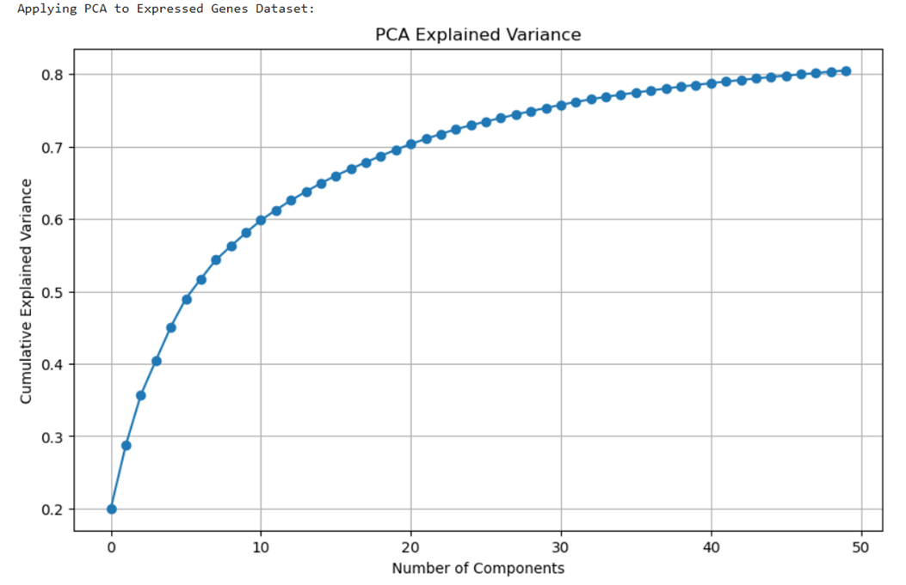

### Elbow & Silhouette Analysis  
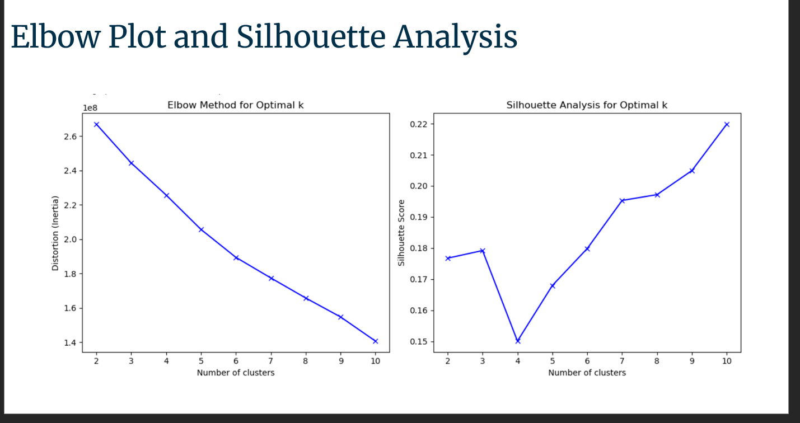

### K-Means Clustering  
**2D:**  
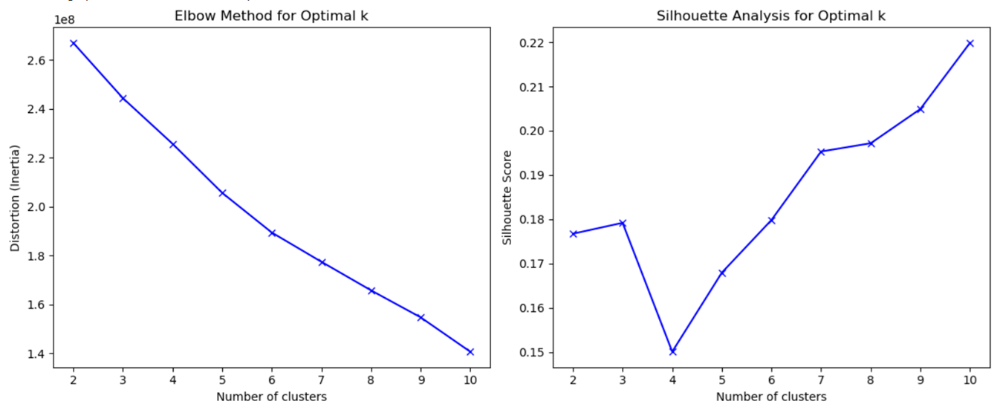  
**3D:**  
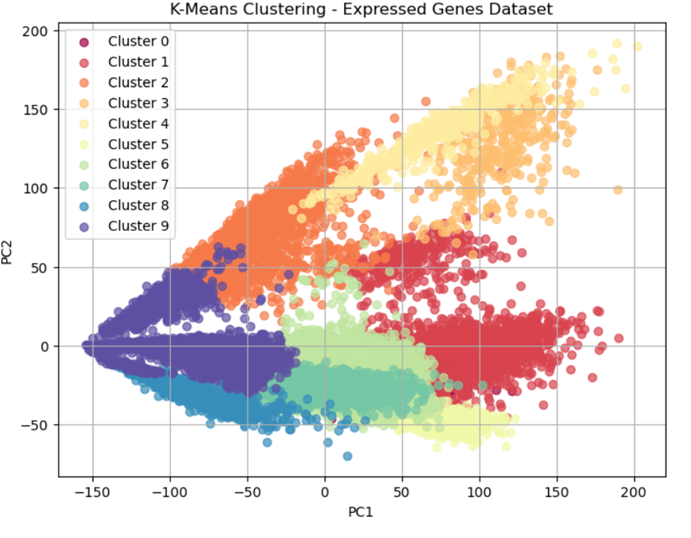

### GMM Clustering  
**2D:**  
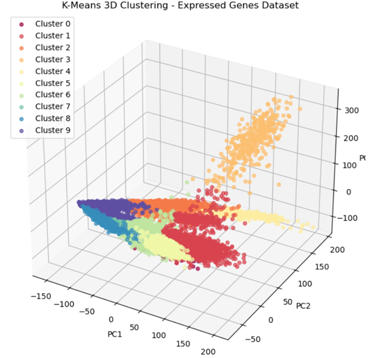  
**3D:**  
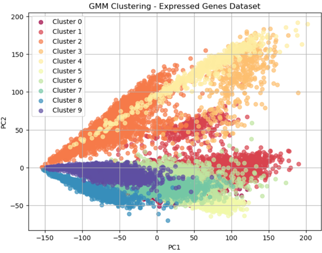

### DBSCAN Clustering  
**2D:**  
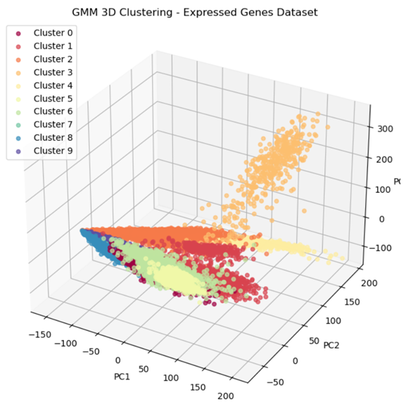  
**3D:**  
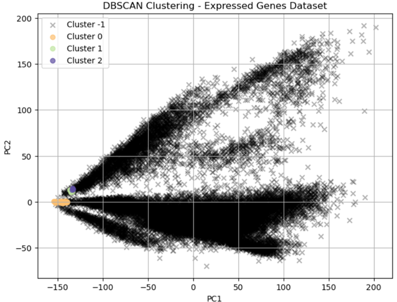

### True Label Visualizations  
**UMAP (True Tissue):**  
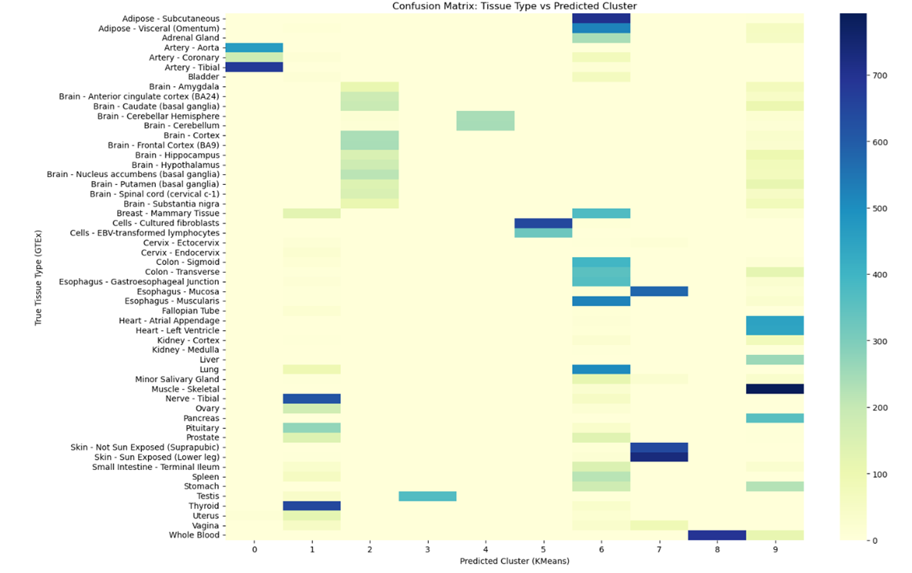  
**t-SNE (True Tissue):**  
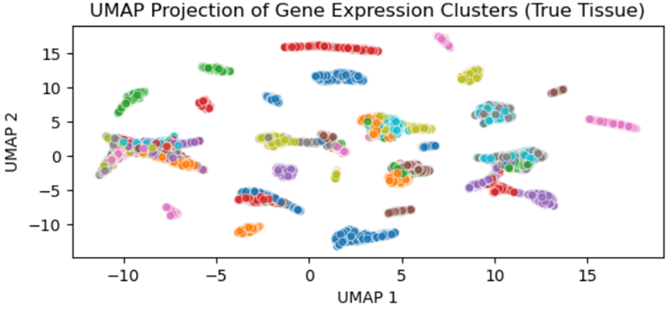

### KMeans Visualizations (t-SNE & UMAP)  
**UMAP (KMeans):**  
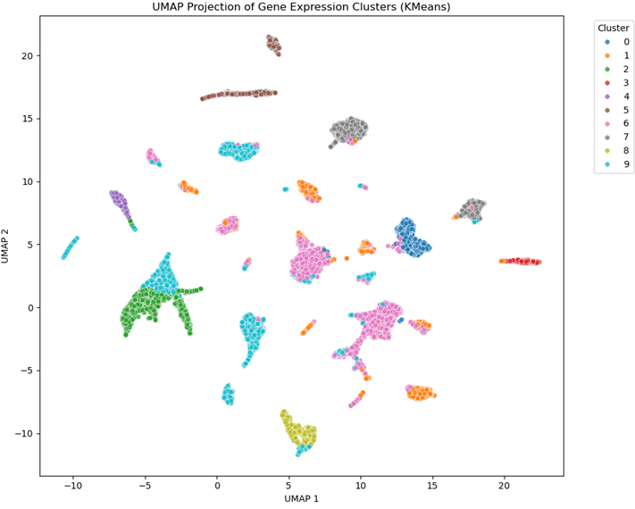  
**t-SNE (KMeans):**  
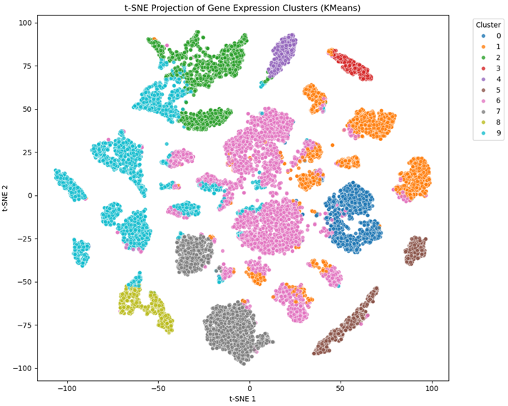

### Confusion Matrix  
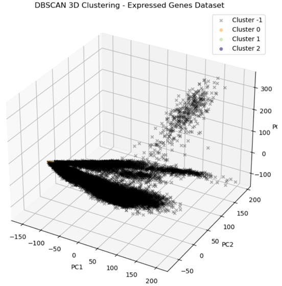

---

## 📈 Results Summary

- ✅ DBSCAN achieved the best silhouette score (0.660) for core points  
- ✅ PCA captured 80% variance in the first 50 components  
- ✅ NMI: 0.571, ARI: 0.191 — indicating good tissue-level grouping from gene expression alone  
- ✅ UMAP and t-SNE revealed distinct tissue clusters visually

---

## 👨‍💻 Author

**Uday Kiran Gogineni** – Clustering & Modeling Lead  
_M.S. in Bioinformatics | RNA-Seq Analysis | Machine Learning in Biology_  
[LinkedIn](https://www.linkedin.com/in/your-profile)

---

## 📄 License

This project is licensed under the MIT License.
